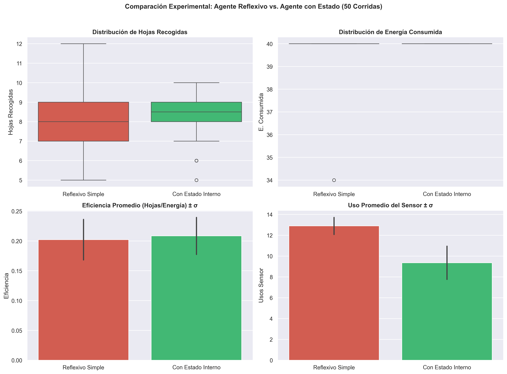
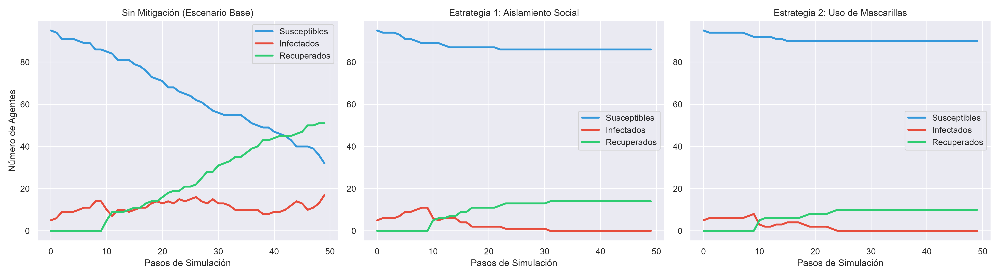

# Taller: Agentes Inteligentes 🤖🧠

Este repositorio contiene la solución completa, rigurosa y reproducible para el **Taller de Agentes Inteligentes** (Curso de Inteligencia Artificial 2026).

---

## 📌 Estructura del Repositorio

- **`Taller_Agentes_Inteligentes.ipynb`**: Notebook de Jupyter con todas las demostraciones teóricas en LaTeX, código Python de simulación (Agente Reflexivo Simple vs. Agente con Estado), análisis de métricas Monte Carlo y modelo epidemiológico SIR con el framework **Mesa**.
- **`solucion_taller.py`**: Motor de simulación en Python (POO + Mesa) para ejecutar las corridas experimentales y generar los gráficos de rendimiento.
- **`images/`**: Gráficos e histogramas explicativos generados durante la experimentación.

---

## 📊 Resultados y Graficación

### 1. Comparativa Experimental: Agente Reflexivo Simple vs. Agente con Estado Interno (50 Corridas Monte Carlo)

| Métrica | Agente Reflexivo Simple | Agente con Estado Interno |
|---|---|---|
| **Hojas recogidas (Promedio)** | 8.06 | **8.34** |
| **Energía consumida (Promedio)** | 39.88 | **40.00** |
| **Número de movimientos (Promedio)** | 26.98 | **30.64** |
| **Uso del sensor (Promedio)** | 12.90 | **9.36** |
| **Eficiencia (Hojas / Energía)** | 0.202 | **0.208** |

### 2. Sistema Multiagente (Mesa): Propagación de Infección SIR y Mitigación

---

## 🎯 Temas Desarrollados

1. **Racionalidad del Agente Aspiradora**: Análisis del escenario de Russell & Norvig, función con costo de movimiento y necesidad de estado interno.
2. **Racionalidad y Horizonte Temporal**: Demostración matemática del impacto de $T$ y ejemplos concretos.
3. **Agente Reflexivo Simple (Robot Aspiradora)**: Simulación en grilla $N \times M$ con sensado de costo energético y reglas condición-acción.
4. **Agente con Estado Interno**: Incorporación de memoria espacial y mapa de sensado para navegación eficiente.
5. **Comparación Experimental**: 50+ simulaciones Monte Carlo por agente, métricas estadísticas ($\bar{E}, \bar{H}$, Eficiencia) y análisis comparativo.
6. **Sistemas Multiagente (Mesa)**: Modelo SIR de propagación de infección y evaluación cuantitativa de 2 estrategias de mitigación (Aislamiento social y Mascarillas/Vacunación).

---
*Curso de Inteligencia Artificial 2026.*
