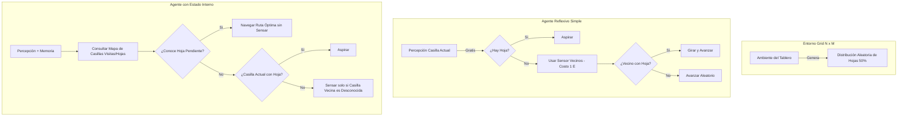

# Marco de Ingeniería de Software Master - Sistema de Agentes Inteligentes y Simulaciones en Python

> [!IMPORTANT]
> Este documento actúa como la **guía definitiva de ingeniería, marco conceptual y directrices de implementación** para la resolución completa del **Taller de Agentes Inteligentes** (Curso de Inteligencia Artificial 2026). Define cómo las 27 disciplinas de la Ciencia de la Computación e Ingeniería de Software se aplican específicamente para maximizar la **racionalidad de los agentes, la eficiencia energética y algorítmica, el modelado multiagente con Mesa, la rigurosidad experimental y la presentación impecable en Jupyter Notebook**.

---

## 🎯 Objetivo Principal del Sistema y Taller
Desarrollar una solución integral, rigurosa y reproducible para el Taller de Agentes Inteligentes mediante un Jupyter Notebook estructurado que contenga:
1. **Demostraciones Teóricas y Análisis de Racionalidad**: Justificación formal de la racionalidad del agente aspiradora (Russell & Norvig), rediseño de función de desempeño con penalización ($-1$ por movimiento), análisis de necesidad de estado interno y demostración de la dependencia entre racionalidad y horizonte temporal $T$ con ejemplos concretos.
2. **Simulador y Agente Reflexivo Simple (Robot Aspiradora)**: Implementación orientada a objetos en Python de un ambiente grid $N \times M$ configurable, sensado con costo energético, movimiento ($90^\circ, 180^\circ, 270^\circ$, avanzar), aspirado de hojas y conjunto de reglas condición-acción optimizado.
3. **Simulador y Agente con Estado Interno**: Evolución del agente incorporando memoria (casillas visitadas, exploradas, hojas detectadas/limpiadas y mapa de conocimiento de sensores) para minimizar movimientos/sensados innecesarios y optimizar drásticamente la eficiencia energética.
4. **Evaluación Experimental y Comparativa**: Batería de $\ge 50$ simulaciones Monte Carlo por agente, métricas estadísticas ($\bar{E}, \bar{H}$, Eficiencia $= H / E$), visualización de curvas/histogramas con Seaborn/Matplotlib y tabla comparativa para responder las 5 preguntas del taller.
5. **Sistema Multiagente de Propagación de Infección (Mesa)**: Modelo SIR (Susceptibles, Infectados, Recuperados) en el framework Mesa, simulación temporal, incorporación y evaluación cuantitativa de 2 estrategias de mitigación (ej. distanciamiento social/aislamiento y vacunación/uso de mascarillas).

---

## 🏛️ El Ecosistema de Ingeniería y sus 27 Disciplinas Aplicadas

| # | Disciplina / Área de Conocimiento | Aplicación Práctica en "Taller de Agentes Inteligentes" | Directriz de Codificación, Diseño y Debugging |
|---|---|---|---|
| **1** | **Pensamiento Algorítmico** | Diseño de la función de agente $f: \mathcal{P}^* \to \mathcal{A}$ y árbol de decisión condición-acción para el agente aspiradora de recolección de hojas. | Modelar las reglas de decisión como funciones puras sin efectos secundarios globales. Evitar estructuras condicionales anidadas profundas usando priorización limpia de reglas. |
| **2** | **Introducción a IA-CC** | Formalización del Agente Racional según Russell & Norvig: maximización de la medida de desempeño esperada dada la secuencia de percepciones y conocimiento incorporado. | Evaluar la racionalidad en función del conocimiento *a priori*, percepciones y acciones, distinguiendo formalmente la racionalidad de la omnisciencia. |
| **3** | **Ciencia Computacional Básica** | Tipado estático (Type Hints en Python / Enums / Dataclasses) para las estructuras fundamentales: `Action`, `Orientation`, `GridState`, `Perception`, `AgentState`. | Definir interfaces inmutables para el paso de percepciones y estados. Todo método de acción debe validar precondiciones de energía $> 0$ y límites de la grilla. |
| **4** | **Fundamentos de Diseño de Software** | Desacoplamiento modular entre la clase `Environment` (matriz $N \times M$, generación estocástica de hojas), la clase `Agent` (sensores, memoria, motor de decisión) y `Simulator`. | Principio de Responsabilidad Única (SRP). El agente nunca muta directamente la matriz del entorno; lo hace únicamente invocando métodos de la API del ambiente. |
| **5** | **Cibernética y Sistemas Inteligentes** | Bucle de Retroalimentación (*Perception-Action Loop*) y actualización dinámica de estado interno según costos energéticos y lecturas de sensores. | Garantizar la convergencia del ciclo de percepción-acción: la simulación debe terminar de forma limpia cuando la energía se agota o el ambiente queda limpio. |
| **6** | **Estructura de Datos Lineales** | Manejo de listas de acciones realizables, historial de trayectorias, colas (`collections.deque`) para exploración BFS y arreglos de métricas experimentales. | Utilizar deques y generadores para almacenar las trazas de ejecución sin saturar la memoria RAM durante las 50+ corridas Monte Carlo. |
| **7** | **Paradigmas de Programación** | Combinación de POO para la abstracción del Agente y el Entorno, y Programación Funcional para agregación y filtrado de datos experimentales (Pandas/NumPy). | La toma de decisiones en el Agente Reflexivo Simple debe ser una función pura que toma percepción actual y retorna la acción óptima sin efectos colaterales. |
| **8** | **Arquitectura de Computadores** | Optimización de memoria RAM y tiempos de cómputo durante corridas iterativas masivas de simulaciones Monte Carlo y pasos temporales en Mesa. | Minimizar el uso de bucles profundos en Python puro al procesar estadísticas agregadas, aprovechando operaciones vectorizadas con NumPy. |
| **9** | **Estructuras de Datos No Lineales** | Representación matricial del espacio $N \times M$, grafos implícitos de navegación entre casillas contiguas y conjuntos hash (`set`) de coordenadas `(x, y)`. | Utilizar `set` para búsquedas en $O(1)$ de casillas visitadas/exploradas y mapas de calor 2D para visualización de densidad de hojas. |
| **10** | **Análisis de Algoritmos** | Planificación de rutas óptimas en el Agente con Estado usando $A^*$ o BFS en grilla con complejidad $O(V + E)$ para reducir giros y movimientos consumidos. | La heurística de navegación (distancia Manhattan refinada) debe penalizar giros redundantes para maximizar la eficiencia energética por hoja recogida. |
| **11** | **Redes de Computación** | Abstracción de propagación de infecciones en el sistema multiagente (Mesa): transmisión de virus en grafos de vecindad espacial por contacto directo. | Definir la matriz o radio de interacción espacial y probabilidad de contagio $p_{\text{contagio}}$ desacoplada del motor de movimiento de la población. |
| **12** | **Ciencia Computacional Intermedia** | Reproducibilidad estocástica mediante el control riguroso de semillas aleatorias (`random.seed`, `numpy.random.seed`). | Fijar semillas globales y por ejecución para garantizar que el Agente Reflexivo y el Agente con Estado se enfrenten a tableros idénticos en las 50 pruebas. |
| **13** | **Bases de Datos** | Almacenamiento y estructuración de resultados de simulación en `pandas.DataFrame` exportables a CSV/JSON con esquema relacional para métricas. | Mantener esquemas consistentes en DataFrames: `sim_id`, `tipo_agente`, `energia_inicial`, `energia_final`, `hojas_recogidas`, `eficiencia`, etc. |
| **14** | **Lenguajes de Programación y Transducción** | Formateo y compilación de celdas Markdown en Jupyter Notebook con ecuaciones matemáticas en LaTeX para las pruebas de racionalidad y horizonte temporal. | Utilizar sintaxis LaTeX rigurosa ($\dots$ y $$\dots$$) para representar formalmente la medida de desempeño esperada y los razonamientos matemáticos. |
| **15** | **Sistemas Operativos** | Gestión eficiente del motor de gráficos de Matplotlib y recursos de CPU durante el barrido de parámetros en modelos multiagente. | Invocar explicitamente `plt.close()` en bucles de simulación para prevenir fugas de memoria (*memory leaks*) en el kernel de Jupyter. |
| **16** | **Ciencia Computacional Avanzada** | Arquitectura multi-capa: Capa Teórica (Modelado PEAS), Capa de Simulación (Agente-Ambiente Python), Capa Epidemiológica (Mesa) y Capa de Analítica. | Diseñar los módulos de código de forma agnóstica para que puedan ejecutarse tanto desde el Notebook como desde scripts de consola de manera independiente. |
| **17** | **Ingeniería de Software** | Estándares Clean Code, PEP 8, modularidad, docstrings completos en español y control de versiones para la entrega del taller. | Código auto-documentado, nombramiento descriptivo de funciones en español/inglés estandarizado y separación clara por secciones del documento. |
| **18** | **Patrones de Diseño de Software** | Patrón *Strategy* para alternar entre comportamientos de agentes (Reflexivo vs Con Estado) y Patrón *Observer/DataCollector* en Mesa. | Definir una clase abstracta base `BaseAgent` de la cual hereden `ReflexiveVacuumAgent` y `StatefulVacuumAgent`, garantizando el cumplimiento de la misma interfaz. |
| **19** | **Computación Paralela y Distribuida** | Ejecución paralela de simulaciones Monte Carlo o barridos de parámetros en Mesa mediante `multiprocessing` / `joblib` para acelerar la toma de datos. | Asegurar que las semillas estocásticas sean independientes por hilo/proceso para evitar sesgos o correlaciones no deseadas en la toma de datos. |
| **20** | **Inteligencia Artificial** | Implementación del marco PEAS (Performance, Environment, Actuators, Sensors) y categorización de entornos (accesible/inaccesible, determinista/estocástico). | Argumentar cuantitativa y cualitativamente la transición de agente reflexivo simple a basado en estado bajo las definiciones de Russell & Norvig. |
| **21** | **Dirección y Gestión de Proyectos** | Cumplimiento estricto de la rúbrica y estructura sugerida del Notebook (puntos 1 al 9) garantizando entregables reproducibles y completos. | Priorizar la corrección técnica y reproducibilidad de los experimentos antes de añadir componentes estéticos secundarios. |
| **22** | **Arquitectura de Software** | *Clean Architecture* en simulaciones: acoplamiento nulo entre la lógica de decisión del agente y los componentes de visualización/graficación. | Los métodos internos del agente no deben ejecutar instrucciones de impresión (`print`) ni llamadas directas a Matplotlib dentro del loop de simulación. |
| **23** | **Seminario de I+D+I** | Investigación de modelos epidemiológicos basados en agentes (SIR) e integración de intervenciones no farmacéuticas (aislamiento) y farmacéuticas (vacunas). | Fundamentar la efectividad de las 2 estrategias de mitigación basándose en la tasa de reproducción básica $R_0$ y la curva de contagios. |
| **24** | **Big Data e Ingeniería de Datos** | Agregación y procesamiento de series temporales de la epidemia (Susceptibles, Infectados, Recuperados) y distribuciones de eficiencia energética. | Calcular estadísticas inferenciales (media, desviación estándar, medianas e intervalos de confianza) para respaldar las conclusiones experimentales. |
| **25** | **Seguridad de la Información** | Control de excepciones, aserciones en el simulador y prevención de bucles infinitos en la navegación espacial del agente. | Implementar un límite máximo de pasos (*guardrail timeout*) por simulación para evitar ejecuciones infinitas si el agente queda atascado. |
| **26** | **Aprendizaje de Máquina** | Compromiso Exploración vs Explotación en el Agente con Estado (decisión entre explorar casillas desconocidas o limpiar casillas conocidas con hojas). | Implementar heurísticas de decisión que prioricen objetivos confirmados antes de incurrir en costos energéticos de exploración aleatoria. |
| **27** | **Diseño Creativo y Presentación Académica** | Presentación visual ejecutiva del Notebook: paleta de colores coherente en Seaborn, diagramas ASCII/Mermaid, tablas Markdown y gráficas anotadas. | Generar gráficos de calidad de publicación (títulos explicativos, ejes rotulados, leyendas claras y marcadores visuales en picos epidémicos y medias). |

---

## 📐 Guía de Resolución Técnica y Análisis Paso a Paso del Taller

### 1. Racionalidad del Agente Aspiradora

#### 1.1 Demostración de Racionalidad (Escenario Russell & Norvig Fig 2.2)
- **Marco Teórico (PEAS)**:
  - **P** (Medida de Desempeño): $+1$ punto por cada casilla limpia en cada intervalo de tiempo.
  - **E** (Ambiente): Dos casillas ($A$ y $B$). Las hojas/suciedad no reaparecen.
  - **A** (Actuadores): `Izquierda`, `Derecha`, `Aspirar`, `NoOp`.
  - **S** (Sensores): Detecta la casilla actual y si está `Limpio` o `Sucio`.
- **Demostración**:
  Un agente racional es aquel que, para cada posible secuencia de percepciones, selecciona una acción que se espera que maximice su medida de desempeño, dada la evidencia provista por la secuencia de percepciones y el conocimiento incorporado.
  - Si la percepción es `[A, Sucio]`, ejecutar `Aspirar` cambia el estado a `Limpio`, otorgando recompensa $+1$ en el siguiente paso. Cualquier otra acción (`Derecha`, `NoOp`) dejaría la casilla sucia, obteniendo $0$.
  - Si la percepción es `[A, Limpio]`, ejecutar `Derecha` traslada al agente a $B$. Si $B$ estaba sucio, le permite aspirarlo en el siguiente paso. Permanecer en $A$ asegura $0$ recompensa adicional en $B$.
  - Por simetría, aplica lo mismo para $B$.
  - *Conclusión*: Dado el conocimiento *a priori* y las percepciones, la función de agente asigna la acción óptima que maximiza el retorno esperado en cada estado perceptivo. Por lo tanto, **su comportamiento es strictly racional**.

#### 1.2 Rediseño de Función de Agente con Penalización por Movimiento ($-1$)
- **Nueva Medida de Desempeño**: $+C_{\text{limpio}}$ por casilla limpia $- 1 \times (\text{número de movimientos realizados})$.
- **Diseño de la Nueva Función Racional**:
  Para evitar que el agente oscile infinitamente entre $A$ y $B$ perdiendo $-1$ en cada paso cuando ambas casillas están limpias, la acción racional tras verificar/limpiar debe ser la inacción (`NoOp`).
  - `[A, Sucio]` $\to$ `Aspirar`
  - `[B, Sucio]` $\to$ `Aspirar`
  - `[A, Limpio]` $\to$ Si se conoce que $B$ fue visitada o si $P(B=\text{Sucio}) \cdot V_{\text{limpio}} < 1$, seleccionar `NoOp`. En caso de ser el primer paso, moverse a $B$. Una vez en $B$ y verificado que está limpio, seleccionar `NoOp`.

#### 1.3 Necesidad de Estado Interno
- **Análisis**: **SÍ, el agente requiere mantener un estado interno.**
- **Justificación**: Un agente reflexivo simple sólo observa el estado presente `[Ubicación, Estado]`. Si la percepción es `[A, Limpio]`, sin memoria el agente no puede distinguir si *acaba de limpiar A y ya limpió B previamente*, o si *acaba de iniciar en A*. Si responde siempre con `Derecha`, al llegar a `[B, Limpio]` responderá con `Izquierda`, cayendo en un **bucle infinito de oscilación** $A \leftrightarrow B$ con penalización energética $-1$ por paso.
- Con un **estado interno** (registrando `visitado_A = True`, `visitado_B = True`), el agente sabe cuándo ambas casillas han sido procesadas y puede ejecutar `NoOp`, preservando su puntuación y actuando de forma verdaderamente racional.

---

### 2. Racionalidad y Horizonte Temporal

#### 2.1 Demostración de la Dependencia del Horizonte Temporal $T$
La medida de desempeño se evalúa como la suma acumulada de recompensas en la ventana $[0, T]$:
$$U(a_1, a_2, \dots, a_T) = \sum_{t=1}^{T} R(s_t, a_t)$$
Si $T$ es pequeño, acciones que requieren una secuencia larga de preparación (ej. viajar durante varios pasos hacia una gran recompensa) tienen un retorno dentro de $[0, T]$ igual a la penalización por viaje sin alcanzar la recompensa. Por lo tanto, la acción que maximiza $U$ a corto plazo ($T$ pequeño) difiere radicalmente de la acción racional para un horizonte amplio ($T$ grande). La racionalidad es **función directa de $T$**.

#### 2.2 Ejemplo 1: Robot Explorador (Recargar vs Viajar al Tesoro)
- **Estado Inicial**: Batería al $20\%$. Estación de Carga a 1 paso ($A$). Zona de Hojas/Tesoro Masivo (+100 puntos) a 4 pasos ($B$).
- **Acciones Disponibles**: `[Ir a Estación de Carga]`, `[Viajar a Zona de Tesoro]`.
- **Caso $T = 2$**:
  - Si elige `Viajar a Zona de Tesoro`: da 2 pasos hacia $B$, no alcanza a llegar, consume batería, recompensa $= 0$.
  - Si elige `Ir a Carga`: llega a la estación en paso 1, recarga en paso 2. Evita apagarse y asegura supervivencia.
  - **Acción Racional ($T=2$)**: `Ir a Estación de Carga`.
- **Caso $T = 10$**:
  - Si elige `Viajar a Zona de Tesoro`: llega en el paso 4, recolecta hojas durante 6 pasos. Recompensa acumulada $= +600$.
  - **Acción Racional ($T=10$)**: `Viajar a Zona de Tesoro`.

#### 2.3 Ejemplo 2: Agente Aspiradora en Grilla (Moverse a Celda Contigua vs NoOp)
- **Estado Inicial**: Casilla actual $X$ está `Limpia`. Casilla contigua $Y$ está `Sucia` (otorga $+10$ al aspirar). Costo de movimiento $= -1$. Costo de aspirar $= -1$.
- **Acciones Disponibles**: `[Aspirar]`, `[Mover a Y]`, `[NoOp]`.
- **Caso $T = 1$**:
  - Si elige `Mover a Y`: ejecuta movimiento en $t=1$ (costo $-1$). La recompensa por estar en $Y$ se obtendría en $t=2$, pero la evaluación termina en $T=1$. Retorno neto $= -1$.
  - Si elige `NoOp`: costo $0$, retorno neto $= 0$.
  - **Acción Racional ($T=1$)**: `NoOp`.
- **Caso $T = 2$**:
  - Si elige `Mover a Y` en $t=1$ (costo $-1$) y `Aspirar` en $t=2$ (costo $-1$, recompensa $+10$). Retorno neto $= +8$.
  - **Acción Racional ($T=2$)**: `Mover a Y`.

---

### 3 y 4. Arquitectura de Simulación: Agente Reflexivo vs Agente con Estado



#### Estructura de Clases en Python (Snippet Arquitectónico)

```python
import random
import numpy as np
import pandas as pd
from enum import Enum
from typing import Tuple, List, Dict, Set, Optional

class Action(Enum):
    AVANZA = "avanzar"
    GIRA_90 = "girar_90"
    GIRA_180 = "girar_180"
    GIRA_270 = "girar_270"
    ASPIRAR = "aspirar"
    NOOP = "noop"

class Orientation(Enum):
    NORTE = 0
    ESTE = 90
    SUR = 180
    OESTE = 270

class Environment:
    def __init__(self, n: int, m: int, prob_hojas: float = 0.5, seed: Optional[int] = None):
        if seed is not None:
            random.seed(seed)
            np.random.seed(seed)
        self.n = n
        self.m = m
        self.grid = (np.random.rand(n, m) < prob_hojas).astype(int)
        self.hojas_iniciales = int(np.sum(self.grid))
    
    def tiene_hoja(self, pos: Tuple[int, int]) -> bool:
        x, y = pos
        return self.grid[x, y] == 1

    def limpiar_hoja(self, pos: Tuple[int, int]) -> bool:
        x, y = pos
        if self.grid[x, y] == 1:
            self.grid[x, y] = 0
            return True
        return False

    def es_valida(self, pos: Tuple[int, int]) -> bool:
        x, y = pos
        return 0 <= x < self.n and 0 <= y < self.m

class BaseAgent:
    def __init__(self, pos_inicial: Tuple[int, int], energia: int, orientacion: Orientation = Orientation.NORTE):
        self.pos = pos_inicial
        self.orientacion = orientacion
        self.energia = energia
        self.hojas_recogidas = 0
        self.movimientos = 0
        self.usos_sensor = 0

    def consumir_energia(self, cantidad: int = 1) -> bool:
        if self.energia >= cantidad:
            self.energia -= cantidad
            return True
        return False
```

---

### 5. Sistemas Multiagente: Propagación de Infección (Mesa)

#### 5.1 Definición del Modelo SIR con Mesa
- **Agentes**: `InfectionAgent` con estados: `SUSCEPTIBLE`, `INFECTED`, `RECOVERED`.
- **Parámetros**:
  - `N_agentes`: Población total.
  - `p_contagio`: Probabilidad de contagiar a un agente susceptible en la misma casilla o vecindad.
  - `t_infeccion`: Pasos que dura la infección antes de recuperarse.
  - `p_movimiento`: Probabilidad de que el agente se mueva en cada paso.

#### 5.2 Estrategias de Mitigación Implementadas
1. **Estrategia 1: Distanciamiento Social / Reducción de Movilidad (Cuarentena Parcial)**
   - *Mecanismo*: Se reduce el parámetro `p_movimiento` del $100\%$ al $20\%$ para agentes asintomáticos/susceptibles y $0\%$ para infectados detectados.
   - *Efecto esperado*: Reduce la tasa de encuentros por unidad de tiempo, aplanando la curva de infectados $I(t)$.
2. **Estrategia 2: Uso de Mascarillas / Inmunización Parcial (Protección de Barrera)**
   - *Mecanismo*: Reduce la probabilidad efectiva de transmisión $p_{\text{contagio}}$ de $0.3$ a $0.05$ (vía uso generalizado de mascarillas o vacunación del $50\%$ de la población inicial).
   - *Efecto esperado*: Disminución drástica del número reproductivo básico $R_0$, evitando el colapso del sistema y conteniendo el brote epidémico.

---

## 🛠️ Reglas de Auditoría, Desarrollo y Entrega del Notebook

Antes de dar por finalizado el Jupyter Notebook del Taller, se debe verificar el cumplimiento del siguiente checklist de calidad:

1. **¿El Notebook combina explicaciones Markdown, ecuaciones LaTeX, tablas y gráficos explicativos?**
2. **¿Cada punto está claramente demarcado e identificado según la estructura sugerida en la página 6 del PDF?**
   - Section 1: Información de Integrantes
   - Section 2: Punto 1 – Racionalidad del agente aspiradora
   - Section 3: Punto 2 – Racionalidad y horizonte temporal
   - Section 4: Punto 3 – Agente reflexivo simple
   - Section 5: Punto 4 – Agente con estado
   - Section 6: Comparación experimental de los agentes (Tabla 1)
   - Section 7: Punto 5 – Sistema multiagente (Mesa)
   - Section 8: Conclusiones generales
   - Section 9: Referencias (Russell & Norvig, Documentación Mesa, etc.)
3. **¿Las simulaciones son 100% reproducibles?** (Uso de `seed` aleatoria fijada para comparaciones justas entre el Agente Reflexivo y el Agente con Estado).
4. **¿Se ejecutaron al menos 50 simulaciones por agente y se calcularon las métricas exactas solicitadas?**
   - Promedio de energía consumida ($\bar{E}$)
   - Promedio de hojas recogidas ($\bar{H}$)
   - Eficiencia $= \bar{H} / \bar{E}$
5. **¿La comparación entre el Agente Reflexivo y el Agente con Estado responde exhaustivamente las 5 preguntas del punto 4.2?**
6. **¿El modelo multiagente con Mesa incluye comparativas visuales "Antes vs Después" de aplicar las 2 estrategias de mitigación?**

---
*Documento de Ingeniería Master para el Taller de Agentes Inteligentes. Versión 1.0.*
